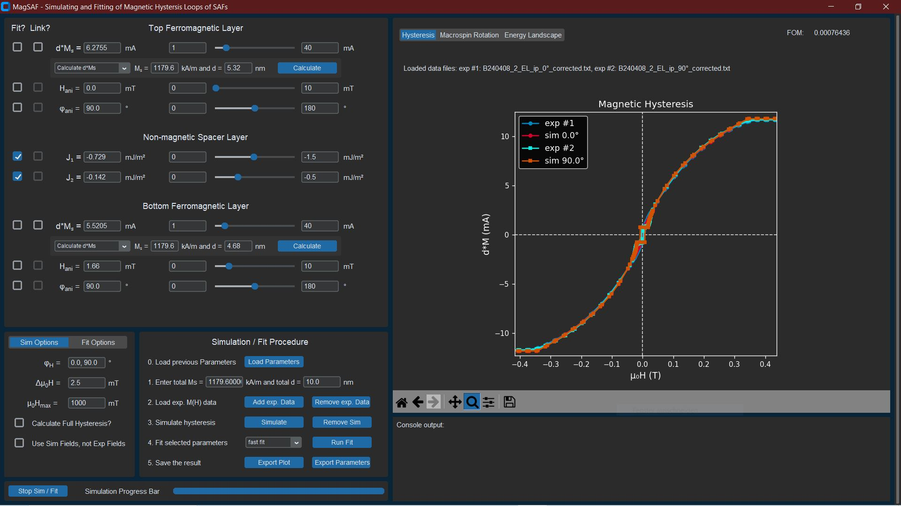

# Welcome to MagSAF's documentation!

MagSAF is a GUI for fast and easy simulations of magnetic hysteresis loops of synthetic antiferromagnets (SAFs). Its target audience are reasearchers who want to get into the field of SAFs. With this software you can get familiar with the influence all magnetic parameters have on the hysteresis loop but also fit your experimental data to extract those magnetic parameters. The simulations are currently based on a macrospin model and the software assumes an in-plane easy axis SAF. It is also possible to simulate and fit uniaxial magnetic anisotropies in both ferromagnetic layers.

In the future, more theoretical models, out-of-plane SAFs as well as more anisotropy options are planned. Any help in this regard is much appreciated.



## Getting started
1. [How to install](#how-to-install)
2. [How to use](#how-to-use)
   - [Loading experimental data](#loading-experimental-data)
   - [Other plots](#other-plots)
   - [Advanced: Asymmetric SAFs](#advanced-asymmetric-safs)
   - [Advanced: Fitting multiple hysteresis loops for a better anisotropy fit](#advanced-fitting-multiple-loops-for-better-anisotropy-fit)
3. [Theoretical Framework](#theoretical-framework)
   - [What is a synthetic antiferromagnet (SAF)?](#what-is-a-synthetic-antiferromagnet-saf)
   - [Coordinate System](#coordinate-system)
   - [Macrospin Model](#macrospin-model)
4. [Fitting procedure](#fitting-procedure)
   - [Figure of Merit](#figure-of-merit)
   - [Fit Boundaries](#fit-boundaries)

## How to install

The easiest option would be to go to the latest release version and download an auto-py-to-exe generated .exe file of MagSAF. Otherwise, you can download the source code, install all required packages with
```
python -m pip install -r requirements.txt
```
and then execute `MagSAF_GUI.py`. This should at least work for **python 3.11.8**.

## How to use 

### Loading experimental data

The data file has to be a .txt file with two columns separated by either '\t' or whitespaces. The first column has to be the magnetic field and the second one the magnetization. For the magnetic field, supported units are 'Oe', 'mT' and 'T' and for the magnetization they are 'A/m' and 'kA/m'. It is assumed that the first row is some header, the second row should include the units of each column and the actual data should start in the third row.

> [!IMPORTANT]
> It is assumed that you want to fit a magnetic hysteresis loop $M(H)$ which is already normalized to the magnetic volume of your sample. Becasue of this, you have to specify the total, magnetic film thickness (the one you assumed to normalize your $M(H)$ data) in Step 1 of the **Simulation / Fit Procedure** section before you can load your data file.

### Other Plots

Besides the magnetic hysteresis $dM(H)$, the user can also plot the macrospin rotation and energy landscape $G(\phi^A, \phi^B)$ during the hysteresis. These additional pieces of information let the user check whether the simulation worked correctly or whether an error occurred. The energy landscape $G(\phi^A, \phi^B)$ plot includes the position of the simulated equilibrium state of the macrospins. This should always be in a local minimum. If it isn't, an error must have occurred.

### Advanced: Asymmetric SAFs

When the ferromagnetic layers of your SAF are asymmetric in thickness or saturation magnetization, you can't just fit one $d \cdot M^i_s$ parameter because the total saturation magnetization of your SAF must stay constant. To do so, you can check one of the checkboxes in the *Link?* column next to one of the $dM^i_s$ parameters and check the *Fit?* Checkbox of the other $d \cdot M^i_s$ parameter. If you do so, the *linked* parameter always gets adjusted to the *fitted* one to keep a constant total saturation magnetization. For this to work, you have to also add the total $M_s$ in **Step 1** of the **Simulation / Fit Procedure**.

> [!TIP]
> After fitting your $dM^i_s$ parameter(s) you can either select *"Calculate d from Ms"* or *"Calculated Ms from d"* form the dropdown menu, input the one required parameter and then press *Calculate* to quickly get the fitted thickness $d$ or saturation magnetization $M_s$.

### Advanced: Fitting multiple loops for a better anisotropy fit

In case your SAF possesses an in-plane uniaxial magnetic anisotropy, you can achieve better fit results by fitting several hysteresis loops for different field angles in parallel. To do so, you can just add more exp. M(H) data (until 3) and then input the respective external field angles in the same order as your loaded exp. data separated by commata in the $\phi^H$ input field.

> [!IMPORTANT]
> For this to work, we assume that the field sequence (aka field steps) is the same for all loaded measurements. Of course, they also need to be measurements of the same sample - just along different external field angles.

## Theoretical Framework

### What is a synthetic antiferromagnet (SAF)?

A synthetic antiferromagnet (SAF) is a magnetic thin film heterostructure. It consists of two ferromagnetic layers (e.g. Co, Fe, etc.) which are separated by a very thin, conductive, non-magnetic layer (e.g. Ru). In such a layer stack, an indirect interlayer coupling arises which is usually described by the Ruderman-Kittel-Kasuya-Yosida (RKKY) model. The coupling can prefer any type of alignment between the two ferromagnetic layers (parallel, anti-parallel or non-collinear) depending on the material parameters - especially the thickness of the non-magnetic layer. The main focus, however, lies on the anti-parallel and non-collinear coupling.

### Coordinate System

Currently, only in-plane SAFs and their simulation/fitting is supported. It is assumed that the external magnetic field, both uniaxial magnetic anisotropies and all magnetic moments always lie within a two dimensional plane (in-plane of the thin film).

### Macrospin Model

Right now, only a macrospin model is implemented. This model simplifies all magnetic moments in one of the ferromagnetic layers to one "macrospin" - similar to the Stoner-Wohlfarth model. Thus, we have two layers ($i$ = $A$, $B$) with their individual macrospin angles $\phi^i$, saturation magnetizations $M^i$, thicknesses $d^i$ and uniaxial anisotropy fields $H_{ani}^i$ and angles $\phi_{ani}^i$.

The magnetic, free energy $G$ of this bilayer system is given by the Zeeman energies, the uniaxial magnetic anisotropies and the bilinear $J_1$ and biquadratic $J_2$ RKKY coupling:
```math
\begin{align*}
G \:\: = &-d^A \: M^A \: [ \: H \: \text{cos}(\phi^A - \phi^H) \: + \: 0.5 \: H_{ani}^A \: \text{cos}(\phi^A - \phi_{ani}^A)^2] \
&-d^B \: M^B \: [ \: H \: \text{cos}(\phi^B - \phi^H) \: + \: 0.5 \: H_{ani}^B \: \text{cos}(\phi^B - \phi_{ani}^B)^2] \
&-J_1 \: \text{cos}(\phi^A - \phi^B) \: - \: J_2 \: \text{cos}(\phi^A - \phi^B)^2
\end{align*}
```

Finding the local minimum of $G(\phi^A, \phi^B)$ gives the equilibrium state for $\phi^A$ and $\phi^B$. As a prerequisite, the $\phi^A$ and $\phi^B$ values of the last hysteresis data point are used as starting parameters for the new local minimizer. For the first data point of a hysteresis loop, saturation is assumed ($\phi^A = \phi^B = \phi^H$).

With $\phi^A$ and $\phi^B$ known for each $H$ field step, the magnetization of the bilayer $M$ can be calculated for all $H$ field steps by
```math
M \: = \: [d^A \: M_s^A \: \text{cos}(\phi^A - \phi^H) \: + \: d^B \: M_s^B \: \text{cos}(\phi^B - \phi^H]/d_{tot}
```

> [!NOTE]
> This model can't distinguish between the thickness $d^i$ and saturation magnetization $M_s^i$ of one layer, since both parameters always come as a pair. This is why, their product $d^i M_s^i$ is used for simulations/fits. Because those values are not very intuitive, a $d^i M_s^i$ calculator is implemented in the GUI.
>
> This is also why we plot $d M$ vs $H$ and why you have to add the total, magnetic thickness $d_{tot}$ before loading experimental $M(H)$ data.

## Fitting procedure

First, a global minimizer is used to find good starting parameters for a subsequent local minimizer. For the global minimizer, [scipy.optimize.differential_evolution](https://docs.scipy.org/doc/scipy-1.15.0/reference/generated/scipy.optimize.differential_evolution.html) method is used. Its *maxiter* and *popsize* parameter can be adjusted by the **fast fit**/**precise fit** option next to the fit button with **precise fit** increasing the *maxiter* and *popsize* parameter. For the subsequent local minimizer, [scipy.optimize.minimize](https://docs.scipy.org/doc/scipy-1.15.0/reference/generated/scipy.optimize.minimize.html) is used with the *L-BFGS-B* method. Both minimizers try to minimize the Figure of Merit (FOM).

### Figure of Merit

The Figure of Merit is calculated by the following equation:

$$\large FOM = \frac{1}{N} \sum_j \frac{\Delta H_j}{\Delta H_{max}} \cdot |1 - \frac{dM^{sim}_j}{dM^{exp}_j}|$$

$N$ is the amount of data points of the full hysteresis loop, $\sum_j$ sums over all data points, $\Delta H_{j}$ is equal to $|H_{j-1} - H_j| + |H_j - H_{j+1}|$ and $\Delta H_{max}$ is the largest $\Delta H_{j}$ of the whole hysteresis loop. This first part eliminates over-weighting of specific field ranges, if the field step size changes during the hysteresis loop (e.g. smaller steps around zero field). $dM^{sim}_i$ and $dM^{exp}_i$ are the simulated and experimental $d \cdot M$ values of the respective data point, where $d \cdot M$ is the total magnetic film thickness multiplied with the total magnetization.

> [!TIP]
> It is possible to deliberatly increase the weight of the FOM in specific field ranges. To do so, the user can set the transition fields between the antiferromagnetic (AFM) and canted (C) as well as between the canted (C) and ferromagnetic (FM) spin alignment (or any other field values) under **Fit Options**. Then, a *Fit Focus Region* can be picked (either AFM, C, FM or none). By doing so, the FOM of the picked region is multiplied by 3 to increase its weight. The regions are defined as:
> ```math
> \begin{align*}
> \text{AFM}:& 0 &< |H\;| &< H_{AFM-C} \\
> \text{C}:& H_{AFM-C} &< |H\;| &< H_{C-FM} \\
> \text{FM}:& H_{C-FM} &< |H\;|
> \end{align*}
> ```

### Fit Boundaries

Currently, it is not possible to fit without boundaries. The fit boundaries are the lower and upper values of the slider of the fitted parameter.

# Credits

The auto-py-to-exe generated exe file of MagSAF uses an icon from [xnimrodx](https://www.freepik.com/icon/3d-model_5846257#fromView=search&page=1&position=60&uuid=06e2772a-4f43-4d64-925a-02484094c58e) from freepik.com.
